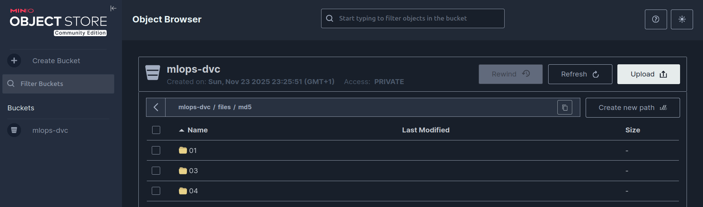
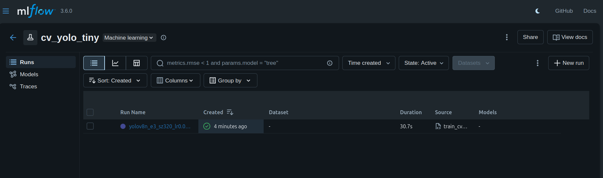
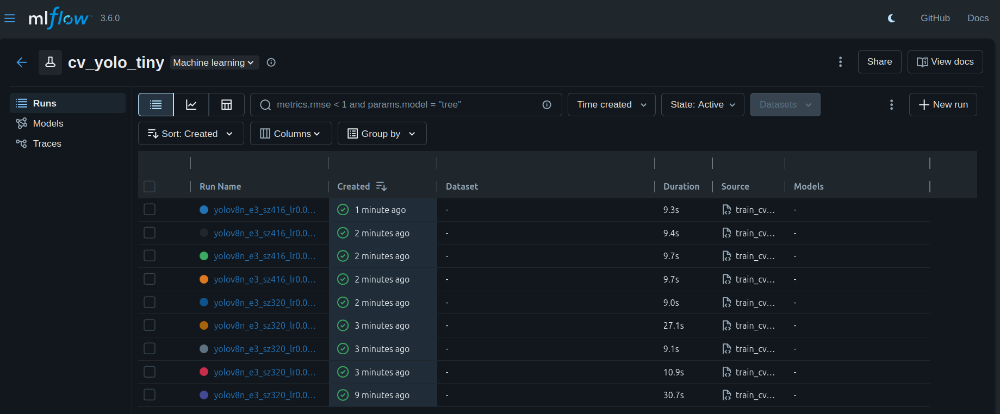
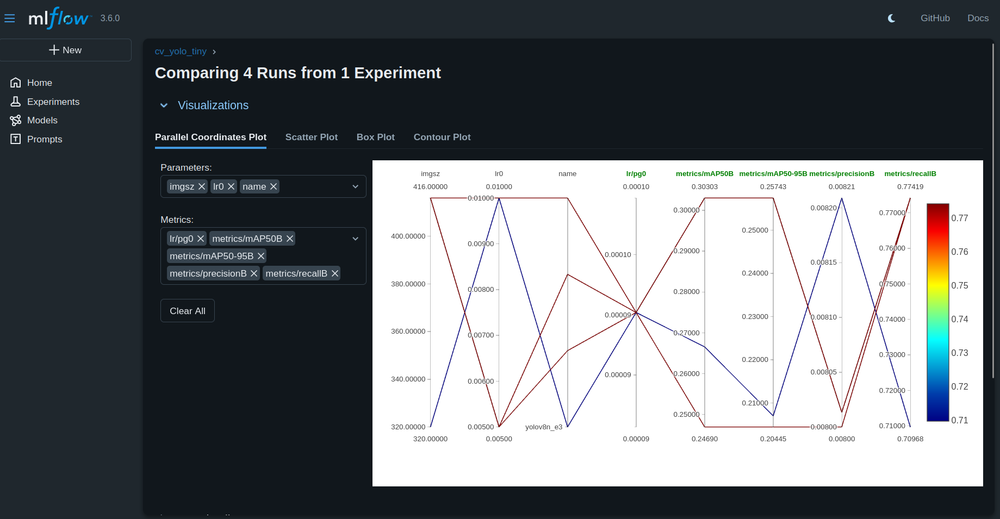
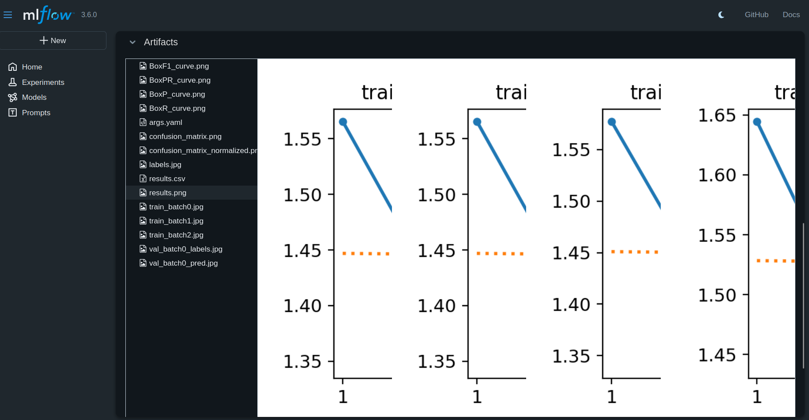
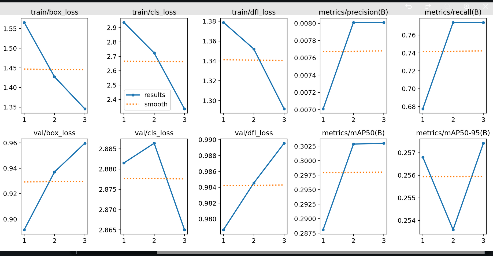
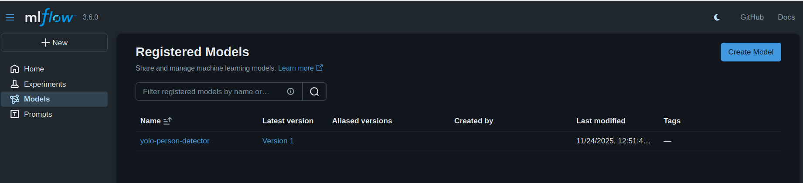

# Compte Rendu TP4 : Experiment Tracking avec MLflow


## Introduction

Ce TP a pour objectif de mettre en place un pipeline MLOps pour le tracking d'expériences de Computer Vision, en utilisant :
- **MLflow** pour le tracking des expériences et le Model Registry
- **DVC** pour le versioning des datasets
- **MinIO** comme stockage S3-compatible pour les artifacts
- **YOLO (Ultralytics)** pour la détection d'objets (classe `person`)

Le projet vise à comparer différentes configurations d'hyperparamètres et à sélectionner le meilleur modèle pour la production.

---

## Configuration de l'environnement

### 1. Création et activation de l'environnement virtuel Anaconda

```bash
conda activate agents
```

J'ai travaillé dans un environnement virtuel Anaconda nommé **`agents`** pour isoler les dépendances du projet.

### 2. Installation des dépendances

```bash
pip install -r requirements.txt
```

**Contenu de `requirements.txt`** :
- `mlflow>=2.10,<3.0` : Tracking des expériences et Model Registry
- `ultralytics>=8.1.0,<9.0` : Framework YOLO pour la détection d'objets
- `opencv-python`, `numpy`, `pandas`, `matplotlib` : Traitement d'images et visualisation
- `pyyaml`, `pillow`, `requests` : Utilitaires

### 3. Démarrage de l'infrastructure MLflow + MinIO

```bash
docker compose up -d
```

Cette commande lance deux conteneurs Docker :

**Conteneur MLflow** (`mlflow:5000`) :
- Interface web pour visualiser les expériences
- Backend SQLite pour les métadonnées
- Stockage local des artifacts dans `/mlflow/artifacts`

**Conteneur MinIO** (`minio:9000`, console `9001`) :
- Stockage S3-compatible pour les artifacts
- Identifiants : `minio` / `minio12345`

---

## Préparation du dataset

### Génération du dataset minimal COCO → Tiny Person

```bash
python tools/make_tiny_person_from_coco128.py
```

**Ce script effectue** :
1. Télécharge/utilise le dataset COCO128 (128 images d'entraînement)
2. Filtre uniquement la classe **`person`** (label `0`)
3. Réorganise les images et labels dans la structure YOLO :
   ```
   data/tiny_coco/
   ├── images/
   │   ├── train/   (128 images)
   │   ├── val/     (128 images de validation)
   │   └── test/    (128 images de test)
   └── labels/
       ├── train/   (annotations YOLO format)
       ├── val/
       └── test/
   ```
4. Génère le fichier de configuration `data/tiny_coco.yaml` :
   ```yaml
   path: data/tiny_coco
   train: images/train
   val: images/val
   test: images/test
   names:
     0: person
   ```

**Résultat** : Dataset léger avec **une seule classe** (`person`) pour accélérer les expérimentations.

---

## Tracking du dataset avec DVC

### Initialisation de DVC

```bash
dvc init
```

Initialise DVC dans le projet Git pour versionner les données volumineuses.

### Ajout du dataset au tracking

```bash
dvc add data/tiny_coco
```

**Effet** :
- Crée `data/tiny_coco.dvc` contenant le hash MD5 du dossier :
  ```
  outs:
  - md5: 0b1b46742dcb489bd65a2a6ef495f646.dir
    size: 2198213
    nfiles: 120
    hash: md5
    path: tiny_coco
  ```
- Met à jour `.gitignore` pour exclure `data/tiny_coco/` (seul le `.dvc` sera versionné)

### Commit Git

```bash
git add data/tiny_coco.dvc .gitignore
git commit -m "Add tiny_coco dataset tracked with DVC"
```

### Push vers le remote S3 (MinIO)



```bash
dvc push
```

**Configuration préalable** (TP précédent) :
```bash
dvc remote add -d myremote s3://mlops-dvc
dvc remote modify myremote endpointurl http://localhost:9000
dvc remote modify myremote access_key_id minio
dvc remote modify myremote secret_access_key minio12345
```

**Résultat** : Le dataset `tiny_coco` est sauvegardé sur le bucket S3 `mlops-dvc`, permettant la reproductibilité et le partage avec l'équipe.

---

## Entraînement baseline

### Lancement du premier run



```bash
python -m src.train_cv --epochs 3 --imgsz 320 --exp-name cv_yolo_tiny
```

**Paramètres par défaut** :
- `--model yolov8n.pt` : YOLO v8 Nano (léger)
- `--epochs 3` : Entraînement rapide (budget limité)
- `--imgsz 320` : Résolution d'entrée 320×320
- `--lr0 0.005` : Learning rate initial
- `--batch 8` : Taille de batch
- `--seed 42` : Seed aléatoire pour reproductibilité

**Ce que fait `src/train_cv.py`** :
1. **Fixe le seed** (`set_global_seed`) pour reproductibilité
2. **Crée une expérience MLflow** nommée `cv_yolo_tiny`
3. **Log les paramètres** : `model`, `epochs`, `imgsz`, `lr0`, `batch`, `seed`, `data`
4. **Entraîne le modèle YOLO** avec Ultralytics
5. **Log les métriques finales** :
   - `precision`, `recall`, `mAP50`, `mAP50-95` (epoch 3)
6. **Log les artifacts** :
   - `results.png`, `confusion_matrix.png`, `PR_curve.png`
   - `weights/best.pt` (meilleur checkpoint)

**Résultat** :
- Run visible dans MLflow UI (`http://localhost:5000`)
- Fichiers locaux dans `runs/detect/yolov8n_e3_sz320_lr0.005_s42/`

---

## Recherche d'hyperparamètres (Grid Search)

### Préparation du script

```bash
chmod +x scripts/run_grid.sh
```

### Lancement de la grille de 8 runs



```bash
bash scripts/run_grid.sh
```

### Explication du script `run_grid.sh`

```bash
#!/usr/bin/env bash
set -e

# Grille : 2 tailles × 2 learning rates × 2 seeds = 8 runs
for SIZE in 320 416; do
  for LR in 0.005 0.010; do
    for SEED in 1 42; do
      python -u src/train_cv.py --data data/tiny_coco.yaml \
        --model yolov8n.pt --epochs 3 --imgsz $SIZE --lr0 $LR --seed $SEED \
        --exp-name cv_yolo_tiny
    done
  done
done
```

**Logique du script** :
1. **Boucles imbriquées** : Teste toutes les combinaisons de :
   - **Image size** : 320×320 et 416×416
   - **Learning rate** : 0.005 et 0.01
   - **Random seed** : 1 et 42 (pour vérifier la reproductibilité)

2. **Options importantes** :
   - `set -e` : Arrête le script si une commande échoue
   - `python -u` : Sortie non bufferisée (logs en temps réel)

3. **Résultat** : 8 runs distincts dans MLflow avec noms auto-générés :
   - `yolov8n_e3_sz320_lr0.005_s1`
   - `yolov8n_e3_sz320_lr0.005_s42`
   - `yolov8n_e3_sz320_lr0.01_s1`
   - `yolov8n_e3_sz320_lr0.01_s42`
   - `yolov8n_e3_sz416_lr0.005_s1`
   - `yolov8n_e3_sz416_lr0.005_s42`
   - `yolov8n_e3_sz416_lr0.01_s1`
   - `yolov8n_e3_sz416_lr0.01_s42`


---

## Analyse et comparaison des expériences

### Comparaison dans l'UI MLflow




**Métriques clés analysées** :
- **mAP@50** : Précision moyenne à 50% IoU (métrique principale)
- **mAP50-95** : Moyenne des mAP de 50% à 95% IoU (plus stricte)
- **Precision** : Proportion de vraies détections parmi les prédictions positives
- **Recall** : Proportion de personnes détectées parmi celles présentes

**Observations dans le tableau de comparaison** :
| Run                           | mAP@50 | mAP50-95 | Precision | Recall |
|-------------------------------|--------|----------|-----------|--------|
| `yolov8n_e3_sz320_lr0.005_s42` | 0.269  | 0.201    | 0.00841   | 0.720  |
| `yolov8n_e3_sz320_lr0.01_s42`  | 0.269  | 0.202    | 0.00842   | 0.726  |
| `yolov8n_e3_sz416_lr0.005_s42` | **0.303** | **0.257** | 0.00801   | **0.774** |
| `yolov8n_e3_sz416_lr0.01_s42`  | 0.244  | 0.204    | 0.00810   | 0.674  |

🏆 **Meilleur run** : `yolov8n_e3_sz416_lr0.005_s42` (+11.5% mAP@50 vs 320×320)

### Visualisation des artifacts



**Artifacts loggés automatiquement** :
- **`results.png`** : Courbes de loss et métriques au fil des epochs
- **`confusion_matrix.png`** : Matrice de confusion (classe `person` vs background)
- **`PR_curve.png`** : Courbe Precision-Recall
- **`labels_correlogram.jpg`** : Distribution spatiale des labels



**Weights loggés** :
- **`weights/best.pt`** : Meilleur checkpoint (basé sur validation mAP)
- Téléchargeable directement depuis MLflow pour déploiement

**Avantages du logging d'artifacts** :
✅ Reproductibilité : Retrouver les graphiques exacts d'un run ancien  
✅ Debugging : Analyser la convergence et les patterns d'erreur  
✅ Déploiement : Récupérer `best.pt` sans chercher dans les dossiers locaux

---

## Décision et promotion du modèle

### Rapport de décision complet

📄 **[Voir le rapport de décision détaillé](reports/templates/decision_template.md)**

Le fichier `reports/templates/decision_template.md` contient une analyse exhaustive :

**Sections principales** :
1. **Objectifs et contraintes** : Maximiser mAP@50, contraintes de latence et budget
2. **Candidat promu** : `yolov8n_e3_sz416_lr0.005_s42`
3. **Comparaison détaillée** :
   - Configuration A : imgsz=320, lr=0.005 → Performances inférieures
   - Configuration B : imgsz=320, lr=0.01 → Pas d'amélioration
   - **Configuration C** ⭐ : imgsz=416, lr=0.005 → **RECOMMANDÉE**
   - Configuration D : imgsz=416, lr=0.01 → Learning rate trop élevé
4. **Analyse POUR/CONTRE** pour chaque configuration
5. **Risques identifiés et mitigations** :
   - Precision faible (0.8%) → Augmenter threshold de confiance
   - Latence accrue → Export ONNX/TensorRT
   - Sous-apprentissage (3 epochs) → Re-entraîner avec 15-20 epochs
6. **Plan d'action** 

**Choix final justifié** :
> **Run** : `yolov8n_e3_sz416_lr0.005_s42`  
> **Justification** : +11.5% mAP@50, reproductibilité prouvée, stabilité, meilleur compromis performance/complexité

### Promotion dans le Model Registry




**Avantages du Model Registry** :
✅ **Versioning** : Historique de tous les modèles déployés  
✅ **Staging** : Tester en `Staging` avant promotion en `Production`  
✅ **Audit trail** : Qui a promu quel modèle, quand et pourquoi  
✅ **Rollback rapide** : Revenir à une version précédente en 1 clic

---


